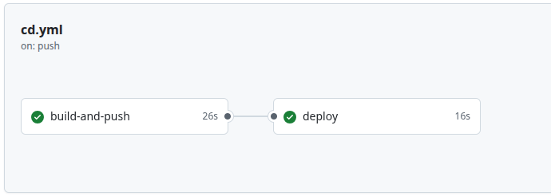
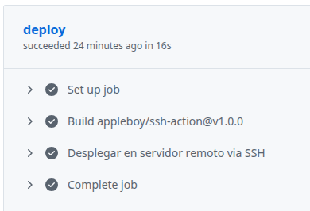
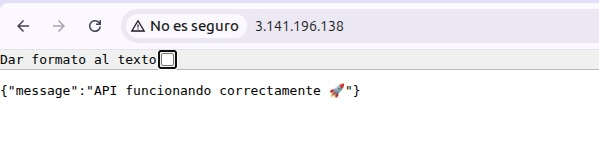
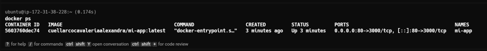
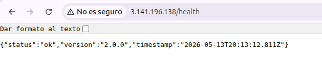
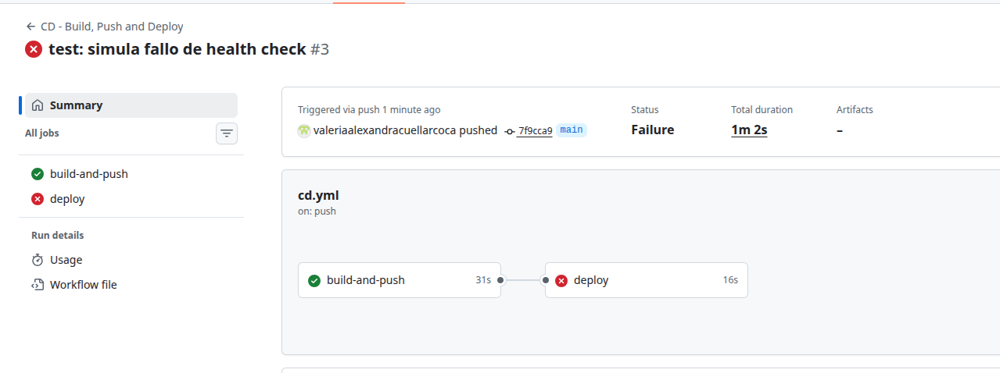
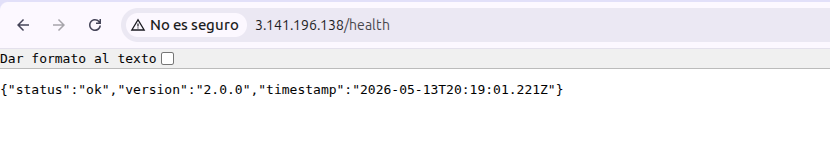

# 📋 Informe — Laboratorio 5.2: Pipeline de Despliegue Continuo con Docker

**Estudiante:** Valeria Alexandra Cuellar Coca  
**Materia:** Trabajando en la Nube  
**Fecha:** Mayo 2026  
**Repositorio:** [api-crud-cd-lab-5.2](https://github.com/valeriaalexandracuellarcoca/api-crud-cd-lab-5.2)

---

## 1. Descripción del Pipeline de CD y Decisiones Técnicas

### 1.1 Arquitectura del Pipeline

El pipeline de Despliegue Continuo (CD) implementado automatiza el flujo completo desde un commit en la rama `main` hasta la aplicación corriendo en producción sobre una instancia EC2 de AWS. El workflow se compone de **dos jobs secuenciales**:

```
Push a main → Build imagen Docker → Push a Docker Hub → SSH a EC2 → Health check → Swap de contenedores
```

| Job | Descripción | Dependencia |
|---|---|---|
| `build-and-push` | Construye la imagen Docker y la publica en Docker Hub con dos tags: el SHA del commit y `latest` | Ninguna |
| `deploy` | Se conecta por SSH al servidor EC2, descarga la nueva imagen y la despliega con validación previa | `build-and-push` |

### 1.2 Decisiones Técnicas

#### Dockerfile Multi-Stage

Se optó por un **build de múltiples etapas** para optimizar la imagen final:

- **Etapa 1 (Builder):** Instala todas las dependencias usando `npm ci --only=production` sobre `node:20-alpine`.
- **Etapa 2 (Runtime):** Copia únicamente los artefactos necesarios (`node_modules`, `package.json`, `app.js`, `server.js`) desde el builder, descartando herramientas de compilación innecesarias.

**Ventajas obtenidas:**
- Imagen final significativamente más liviana (solo runtime + código).
- Menor superficie de ataque al no incluir herramientas de build.
- Mejor aprovechamiento de la caché de Docker al copiar `package*.json` antes del código fuente.

#### Usuario no-root en el contenedor

Se creó un usuario `appuser` dentro del contenedor para ejecutar la aplicación sin privilegios de root, siguiendo las buenas prácticas de seguridad en contenedores.

#### Etiquetado dual de imágenes

Cada imagen se publica con **dos tags**:
- `latest`: permite al servidor siempre descargar la versión más reciente con `docker pull`.
- `SHA del commit` (ej. `a1b2c3d...`): permite hacer rollback preciso a cualquier versión anterior sin ambigüedad.

#### Estrategia de despliegue Blue-Green simplificada

El script de deploy no reemplaza el contenedor activo directamente. En su lugar:

1. Lanza el nuevo contenedor en el **puerto 3001** (puerto alterno de validación).
2. Espera 5 segundos para la inicialización.
3. Ejecuta un **health check** (`curl -sf http://localhost:3001/health`).
4. **Solo si el health check es exitoso**, detiene el contenedor anterior y expone el nuevo en el **puerto 80**.
5. Si el health check falla, elimina el contenedor nuevo y sale con `exit 1`, dejando la versión anterior intacta.

Esta estrategia garantiza **cero downtime** en caso de que la nueva versión tenga errores críticos.

#### Gestión segura de secretos

Todas las credenciales sensibles se almacenan como **GitHub Repository Secrets**:
- `DOCKER_USERNAME` y `DOCKER_PASSWORD` (Access Token de Docker Hub).
- `SSH_HOST`, `SSH_USER` y `SSH_PRIVATE_KEY` para la conexión remota a EC2.

Ningún secreto se expone en el código fuente ni en los logs del pipeline.

---

## 2. Evidencia del Pipeline en GitHub Actions

### 2.1 Vista general del workflow ejecutándose

> **(CAPTURA 1 — Paso 5.4):** 



### 2.2 Detalle del job `build-and-push`

> **(CAPTURA 2 — Paso 5.4):** 


### 2.3 Detalle del job `deploy`

> **(CAPTURA 3 — Paso 5.4):** 



---

## 3. Aplicación Funcionando en la Instancia Remota

### 3.1 Endpoint `/health` desde el navegador

> **(CAPTURA 4 — Paso 5.5):** 


### 3.2 Endpoint raíz `/` desde el navegador

> **(CAPTURA 5 — Paso 5.5):** 



### 3.3 Verificación con `docker ps` en el servidor EC2

> **(CAPTURA 6 — Paso 5.5):** 



---

## 4. Verificación del Despliegue y Actualización Automática

### 4.1 Despliegue de una nueva versión (v2.0.0)

Se modificó el endpoint `/health` en `app.js` para retornar `version: '2.0.0'` y se realizó push a `main`. El pipeline se disparó automáticamente y desplegó la nueva versión.

> **(CAPTURA 7 — Ejercicio 3.4, Paso 6.1):** 



### 4.2 Simulación de fallo del health check

Se introdujo un error deliberado (comentando el endpoint `/health`) para verificar que el mecanismo de protección funciona correctamente.

**Resultado esperado:**
- El job `build-and-push` termina exitosamente ✅ (la imagen se construye sin problemas).
- El job `deploy` falla con ❌ porque el health check no recibe respuesta.
- La versión anterior **sigue funcionando** en el puerto 80 sin interrupción.

> **(CAPTURA 8 — Ejercicio 3.4, Paso 6.2):** Comentar el endpoint `/health`, hacer push, y capturar en GitHub Actions el job `deploy` fallando con ❌ mostrando "Health check FALLIDO".



> **(CAPTURA 9 — Ejercicio 3.4, Paso 6.2):** Después del fallo, verificar que la API anterior sigue funcionando visitando `http://IP_PUBLICA_EC2/health` y capturando que aún responde la versión anterior.



---

## 5. Escaneo de Vulnerabilidades

Se integró un paso de escaneo de vulnerabilidades en el pipeline utilizando **Trivy** (`aquasecurity/trivy-action`), que analiza la imagen Docker publicada en busca de vulnerabilidades conocidas en el sistema operativo y las bibliotecas del proyecto.

```yaml
- name: Escaneo de vulnerabilidades
  uses: aquasecurity/trivy-action@master
  with:
    image-ref: ${{ secrets.DOCKER_USERNAME }}/mi-app:${{ github.sha }}
    format: 'table'
    exit-code: '0'
    ignore-unfixed: true
    vuln-type: 'os,library'
    severity: 'CRITICAL,HIGH'
```

**Configuración del escaneo:**
- **`exit-code: '0'`**: El pipeline no falla si se encuentran vulnerabilidades (solo informa). Se podría cambiar a `'1'` para bloquear despliegues con vulnerabilidades críticas.
- **`ignore-unfixed: true`**: Ignora vulnerabilidades que aún no tienen parche disponible.
- **`severity: 'CRITICAL,HIGH'`**: Solo reporta vulnerabilidades de severidad crítica y alta.

> **(CAPTURA 10 — Práctica Individual, después de agregar Trivy al workflow):** En GitHub Actions, expandir el step "Escaneo de vulnerabilidades" y capturar la tabla de resultados del escaneo de Trivy.


---

## 6. Procedimiento de Rollback a una Versión Anterior

### 6.1 ¿Cuándo se necesita un rollback?

Un rollback es necesario cuando se descubre un bug en producción **después** de que el health check pasó exitosamente. El health check valida que la aplicación inicia y responde en `/health`, pero no puede detectar todos los errores de lógica de negocio.

### 6.2 Pasos para ejecutar un rollback manual

**Paso 1: Identificar el SHA del commit de la versión estable**

```bash
# En el repositorio local, revisar el historial
git log --oneline

# Ejemplo de salida:
# a1b2c3d (HEAD -> main) feat: versión con bug     ← VERSIÓN ACTUAL (con bug)
# e4f5g6h feat: versión estable v2.0.0              ← VERSIÓN A RESTAURAR
# i7j8k9l cd: agrega pipeline de CD
```

El SHA de la versión buena sería `e4f5g6h`.

**Paso 2: Ejecutar el rollback directamente en el servidor EC2**

```bash
# Conectarse al servidor
ssh -i mi-llave.pem ubuntu@IP_PUBLICA_EC2

# Definir variables
SHA_ANTERIOR="e4f5g6h"
USUARIO="TU_USUARIO_DOCKERHUB"

# Descargar la imagen de la versión anterior (existe en Docker Hub gracias al tag SHA)
docker pull $USUARIO/mi-app:$SHA_ANTERIOR

# Detener y eliminar el contenedor con bug
docker stop mi-app
docker rm mi-app

# Levantar la versión anterior
docker run -d \
  --name mi-app \
  --restart unless-stopped \
  -p 80:3000 \
  $USUARIO/mi-app:$SHA_ANTERIOR

# Verificar que el rollback fue exitoso
curl http://localhost/health
```

**Paso 3: Corregir el bug en el código fuente**

Después de restaurar la versión estable en producción, corregir el bug en el código, hacer commit y push. El pipeline desplegará automáticamente la versión corregida.

### 6.3 ¿Por qué funciona el rollback?

Funciona porque **cada imagen publicada en Docker Hub tiene un tag con el SHA del commit** que la generó. Esto significa que cada versión es inmutable y recuperable. No se sobreescriben las versiones anteriores, solo se actualiza el tag `latest`.

> **(CAPTURA 11 — Ejercicio 3.4, Paso 6.3):** Ir a Docker Hub, entrar al repositorio de la imagen y capturar la lista de tags mostrando múltiples versiones (latest + varios SHA).


---

## 7. Configuración de Entornos (GitHub Environments)

Se configuraron dos entornos en GitHub: **staging** y **production**, cada uno con sus propios secretos de despliegue.

> **(CAPTURA 12 — Práctica Individual, Paso 7.3):** Ir a **Settings > Environments** en el repositorio de GitHub y capturar mostrando los entornos `staging` y `production` creados.


El workflow de deploy utiliza la directiva `environment: production` para vincular el job al entorno correspondiente y acceder a sus secretos específicos:

```yaml
deploy:
  needs: build-and-push
  runs-on: ubuntu-latest
  environment: production
  steps:
    - name: Desplegar en produccion
      uses: appleboy/ssh-action@v1.0.0
      with:
        host: ${{ secrets.SSH_HOST }}
        username: ${{ secrets.SSH_USER }}
        key: ${{ secrets.SSH_PRIVATE_KEY }}
        script: |
          docker pull ${{ secrets.DOCKER_USERNAME }}/mi-app:latest
          docker stop mi-app || true
          docker rm mi-app || true
          docker run -d --name mi-app --restart unless-stopped -p 80:3000 ${{ secrets.DOCKER_USERNAME }}/mi-app:latest
```

---

## 8. Reflexión: Ventajas de Contenedores y Despliegue Continuo

### 8.1 Ventajas de Docker en el flujo de desarrollo

| Ventaja | Descripción |
|---|---|
| **Consistencia de entornos** | Docker garantiza que la aplicación corre exactamente igual en desarrollo, staging y producción. Se elimina el clásico problema "funciona en mi máquina". |
| **Aislamiento** | Cada contenedor es independiente: tiene sus propias dependencias, variables de entorno y sistema de archivos. Un error en un contenedor no afecta a otros. |
| **Portabilidad** | La imagen Docker puede ejecutarse en cualquier servidor con Docker instalado, independientemente del sistema operativo subyacente (Ubuntu, Amazon Linux, etc.). |
| **Escalabilidad** | Es trivial levantar múltiples instancias del mismo contenedor detrás de un balanceador de carga. Herramientas como Docker Swarm o Kubernetes facilitan la orquestación. |
| **Versionamiento inmutable** | Cada imagen es una instantánea inmutable de la aplicación. Esto permite rollbacks instantáneos y auditoría completa del historial de despliegues. |

### 8.2 Ventajas del Despliegue Continuo (CD)

| Ventaja | Descripción |
|---|---|
| **Automatización completa** | Desde el commit hasta producción, no se requiere intervención manual. Esto reduce errores humanos y acelera el ciclo de entrega. |
| **Feedback rápido** | Si un despliegue falla (por ejemplo, el health check no pasa), el equipo recibe notificación inmediata a través de GitHub Actions. |
| **Entregas frecuentes** | Al automatizar el despliegue, el equipo puede liberar cambios pequeños y frecuentes en lugar de grandes releases arriesgados. |
| **Seguridad integrada** | El escaneo de vulnerabilidades (Trivy) se ejecuta automáticamente en cada push, detectando problemas de seguridad antes de que lleguen a producción. |
| **Trazabilidad** | Cada despliegue está vinculado a un commit específico (tag SHA), facilitando la identificación de qué cambio introdujo un problema. |

### 8.3 Aplicación en proyectos reales

En un proyecto real de producción, este pipeline se extendería con:

- **Tests automatizados** antes del build (unit tests, integration tests) para garantizar la calidad del código.
- **Múltiples entornos** (development → staging → production) con aprobaciones manuales entre etapas críticas.
- **Monitoreo y alertas** post-despliegue con herramientas como Prometheus, Grafana o AWS CloudWatch.
- **Orquestación con Kubernetes** para manejar múltiples servicios, auto-scaling y self-healing.
- **Canary deployments** o **blue-green deployments** más sofisticados para exponer gradualmente la nueva versión a un porcentaje del tráfico.

La combinación de contenedores + CD representa el estándar de la industria para equipos de desarrollo modernos, permitiendo entregar valor al usuario final de forma rápida, segura y confiable.

---

## 9. Resumen de Capturas Requeridas

| # | Captura | Paso de la guía | Qué capturar |
|---|---|---|---|
| 1 | Pipeline vista general | Paso 5.4 | Pestaña Actions, workflow con ambos jobs ✅ |
| 2 | Job build-and-push | Paso 5.4 | Steps expandidos del job build-and-push |
| 3 | Job deploy | Paso 5.4 | Step SSH expandido con mensajes de éxito |
| 4 | Health check navegador | Paso 5.5 | Navegador con `http://IP/health` respondiendo |
| 5 | Endpoint raíz navegador | Paso 5.5 | Navegador con `http://IP/` respondiendo |
| 6 | Docker ps en EC2 | Paso 5.5 | Terminal SSH con `docker ps` mostrando mi-app |
| 7 | Health check v2.0.0 | Ejercicio 3.4 (6.1) | Navegador mostrando `version: 2.0.0` tras actualización |
| 8 | Health check fallido | Ejercicio 3.4 (6.2) | Actions mostrando job deploy con ❌ |
| 9 | API sigue funcionando | Ejercicio 3.4 (6.2) | Navegador mostrando que la versión anterior sigue activa |
| 10 | Escaneo Trivy | Práctica Individual | Step de Trivy expandido con tabla de resultados |
| 11 | Tags Docker Hub | Ejercicio 3.4 (6.3) | Docker Hub mostrando múltiples tags de la imagen |
| 12 | GitHub Environments | Práctica Individual (7.3) | Settings > Environments con staging y production |
