# 📋 Informe — Práctica Individual: Pipeline de Despliegue Continuo con Docker

**Estudiante:** Valeria Alexandra Cuellar Coca  
**Materia:** Trabajando en la Nube  
**Fecha:** 13 de Mayo del 2026  
**Repositorio:** [api-crud-cd-lab-5.2](https://github.com/valeriaalexandracuellarcoca/api-crud-cd-lab-5.2)

---

## 1. Descripción del Pipeline de CD y Decisiones Técnicas

### 1.1 Arquitectura del Pipeline

Se configuró un pipeline de Despliegue Continuo (CD) completo que automatiza el flujo desde un push a la rama `main` hasta el despliegue en **dos instancias EC2 independientes** (staging y production). El workflow consta de **tres jobs secuenciales**:

```
Push a main → Build + Push Docker Hub → Escaneo Trivy → Deploy Staging → Deploy Production
```

| Job | Environment | Descripción | Dependencia |
|---|---|---|---|
| `build-and-push` | — | Construye la imagen Docker, la publica en Docker Hub y ejecuta escaneo de vulnerabilidades con Trivy | Ninguna |
| `deploy-staging` | `staging` | Despliega en la instancia EC2 de staging con health check previo | `build-and-push` |
| `deploy-production` | `production` | Despliega en la instancia EC2 de producción con health check previo | `deploy-staging` |

### 1.2 Decisiones Técnicas

#### Dockerfile Multi-Stage

Se implementó un **build de múltiples etapas** para optimizar el tamaño y la seguridad de la imagen final:

- **Etapa 1 (Builder):** Utiliza `node:20-alpine` como base. Instala las dependencias de producción con `npm ci --only=production`, aprovechando la caché de Docker al copiar `package*.json` antes del código fuente.
- **Etapa 2 (Runtime):** Copia exclusivamente los artefactos necesarios (`node_modules`, `package.json`, `app.js`, `server.js`) desde el builder, descartando cualquier herramienta de compilación intermedia.

**Ventajas obtenidas:**
- Imagen final significativamente más liviana (solo runtime + código).
- Menor superficie de ataque al no incluir herramientas de build.
- Mejor aprovechamiento de la caché de capas de Docker.

#### Usuario no-root en el contenedor

Se creó un usuario `appuser` dentro del contenedor mediante `addgroup` y `adduser`. La aplicación se ejecuta con este usuario sin privilegios de root, siguiendo las buenas prácticas de seguridad en contenedores.

#### Etiquetado dual de imágenes

Cada imagen se publica con **dos tags**:
- **`latest`**: permite al servidor descargar siempre la versión más reciente con `docker pull`.
- **SHA del commit** (ej. `d1bf0fb...`): permite realizar rollback preciso a cualquier versión anterior sin ambigüedad.

#### Estrategia de despliegue Blue-Green simplificada

En cada entorno (staging y production), el script de deploy no reemplaza el contenedor activo directamente. En su lugar:

1. Lanza el nuevo contenedor en el **puerto 3001** (puerto alterno de validación).
2. Espera 5 segundos para la inicialización.
3. Ejecuta un **health check** (`curl -sf http://localhost:3001/health`).
4. **Solo si el health check es exitoso**, detiene el contenedor anterior y expone el nuevo en el **puerto 80**.
5. Si el health check falla, elimina el contenedor nuevo y sale con `exit 1`, manteniendo la versión anterior intacta.

Esta estrategia garantiza **cero downtime** en caso de que la nueva versión tenga errores críticos.

#### Dos entornos con instancias EC2 independientes

Se configuraron **dos GitHub Environments** (`staging` y `production`), cada uno con sus propios **Environment Secrets** apuntando a instancias EC2 diferentes:

| Environment | Secrets | Instancia EC2 |
|---|---|---|
| `staging` | `SSH_HOST`, `SSH_USER`, `SSH_PRIVATE_KEY` | EC2 de staging |
| `production` | `SSH_HOST`, `SSH_USER`, `SSH_PRIVATE_KEY` | EC2 de producción |

Los secretos `DOCKER_USERNAME` y `DOCKER_PASSWORD` se mantienen como **Repository Secrets** compartidos por ambos entornos.

#### Gestión segura de secretos

Ningún secreto se expone en el código fuente ni en los logs del pipeline. Las credenciales de Docker Hub se almacenan a nivel de repositorio, mientras que las credenciales SSH son específicas de cada environment.

---

## 2. Capturas del Pipeline en GitHub Actions

### 2.1 Vista general del workflow con los 3 jobs

> **(CAPTURA — Pestaña Actions):** Capturar el workflow "CD - Build, Push and Deploy" mostrando los tres jobs (`build-and-push`, `deploy-staging`, `deploy-production`) completados con ✅.

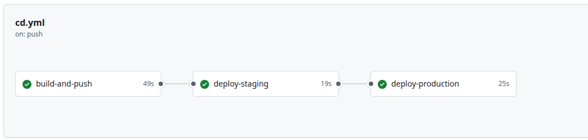

### 2.2 Detalle del job `build-and-push`

> **(CAPTURA — Job build-and-push):** Expandir los steps del job mostrando: Checkout, Login a Docker Hub, Build y Push, y Escaneo de vulnerabilidades completados.

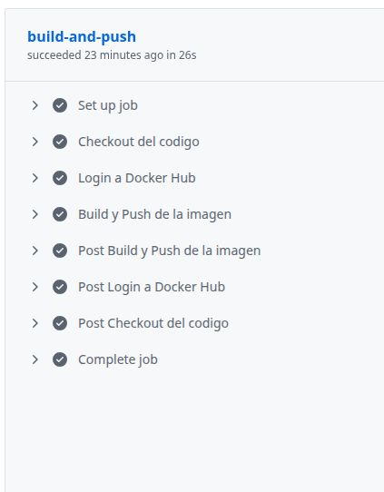

### 2.3 Detalle del job `deploy-staging`

> **(CAPTURA — Job deploy-staging):** Expandir el step SSH mostrando los mensajes de despliegue en staging con "✅ Health check exitoso en STAGING" y "✅ Despliegue en STAGING completado".

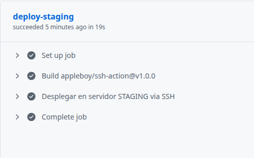

### 2.4 Detalle del job `deploy-production`

> **(CAPTURA — Job deploy-production):** Expandir el step SSH mostrando los mensajes de despliegue en producción con "✅ Health check exitoso en PRODUCTION" y "✅ Despliegue en PRODUCTION completado".

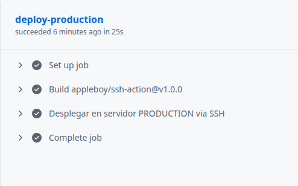

---

## 3. Aplicación Funcionando en las Instancias Remotas

### 3.1 Staging — Endpoint `/health`

> **(CAPTURA — Navegador):** Visitar `http://IP_STAGING/health` y capturar la respuesta JSON.

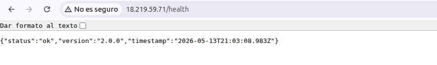

### 3.2 Production — Endpoint `/health`

> **(CAPTURA — Navegador):** Visitar `http://IP_PRODUCTION/health` y capturar la respuesta JSON.

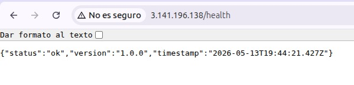

### 3.3 Verificación con `docker ps` en ambos servidores

> **(CAPTURA — Terminal SSH):** Conectarse a cada EC2 y ejecutar `docker ps`. Capturar mostrando el contenedor `mi-app` corriendo y mapeado al puerto 80.

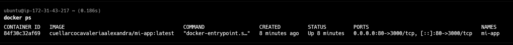

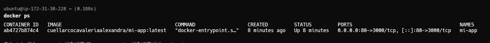

---

## 4. Escaneo de Vulnerabilidades

Se integró un paso de escaneo de vulnerabilidades en el job `build-and-push` utilizando **Trivy** (`aquasecurity/trivy-action`). Este escaneo analiza la imagen Docker publicada en busca de vulnerabilidades conocidas en el sistema operativo base y las bibliotecas del proyecto.

**Configuración implementada:**

```yaml
- name: Escaneo de vulnerabilidades
  uses: aquasecurity/trivy-action@master
  with:
    image-ref: ${{ secrets.DOCKER_USERNAME }}/mi-app:${{ github.sha }}
    format: 'table'
    exit-code: '0'
    ignore-unfixed: true
    vuln-type: 'os,library'
    severity: 'CRITICAL,HIGH'
```

| Parámetro | Valor | Justificación |
|---|---|---|
| `format` | `table` | Genera un reporte legible directamente en los logs de Actions |
| `exit-code` | `0` | El pipeline no falla si se encuentran vulnerabilidades (solo informa). Se podría cambiar a `1` para bloquear despliegues con vulnerabilidades críticas |
| `ignore-unfixed` | `true` | Ignora vulnerabilidades que aún no tienen parche disponible, reduciendo ruido en el reporte |
| `severity` | `CRITICAL,HIGH` | Solo reporta vulnerabilidades de severidad crítica y alta, enfocando la atención en lo urgente |

> **(CAPTURA — Step Trivy):** En GitHub Actions, expandir el step "Escaneo de vulnerabilidades" dentro del job `build-and-push` y capturar la tabla de resultados.

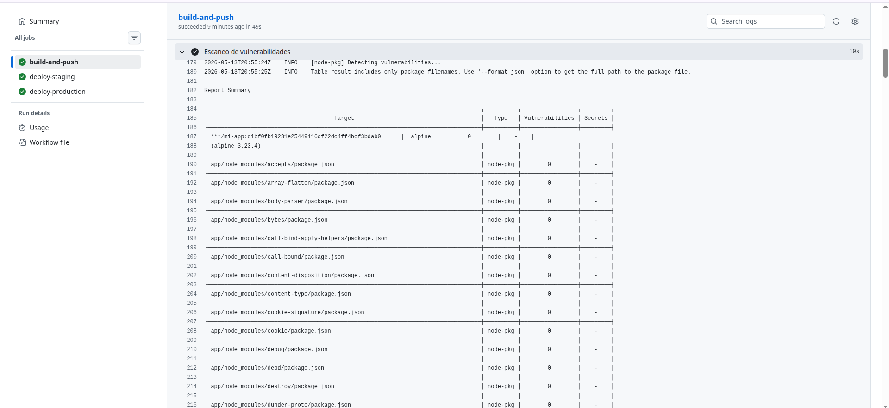

---

## 5. Procedimiento de Rollback a una Versión Anterior

### 5.1 ¿Cuándo se necesita un rollback?

Un rollback es necesario cuando se descubre un bug en producción **después** de que el health check pasó exitosamente. El health check valida que la aplicación inicia y responde en `/health`, pero no puede detectar todos los errores de lógica de negocio.

### 5.2 Pasos para ejecutar un rollback manual

**Paso 1: Identificar el SHA del commit de la versión estable**

```bash
# En el repositorio local, revisar el historial
git log --oneline

# Ejemplo de salida:
# d1bf0fb (HEAD -> main) feat: versión con bug     ← VERSIÓN ACTUAL (con bug)
# b374064 feat: versión estable                     ← VERSIÓN A RESTAURAR
# 3a35655 cd: agrega pipeline de CD
```

El SHA completo de la versión buena se obtiene con `git log` (40 caracteres).

**Paso 2: Ejecutar el rollback directamente en el servidor EC2**

```bash
# Conectarse al servidor de producción
ssh -i mi-llave.pem ubuntu@IP_PRODUCTION

# Definir variables
SHA_ANTERIOR="b374064..."  # SHA completo del commit estable
USUARIO="TU_USUARIO_DOCKERHUB"

# Descargar la imagen de la versión anterior (existe en Docker Hub gracias al tag SHA)
docker pull $USUARIO/mi-app:$SHA_ANTERIOR

# Detener y eliminar el contenedor con bug
docker stop mi-app
docker rm mi-app

# Levantar la versión anterior
docker run -d \
  --name mi-app \
  --restart unless-stopped \
  -p 80:3000 \
  $USUARIO/mi-app:$SHA_ANTERIOR

# Verificar que el rollback fue exitoso
curl http://localhost/health
```

**Paso 3: Corregir el bug en el código fuente**

Después de restaurar la versión estable en producción, se corrige el bug en el código, se hace commit y push. El pipeline desplegará automáticamente la versión corregida pasando primero por staging y luego por producción.

### 5.3 ¿Por qué funciona el rollback?

Funciona porque **cada imagen publicada en Docker Hub tiene un tag con el SHA del commit** que la generó. Esto significa que cada versión es inmutable y recuperable. No se sobreescriben las versiones anteriores; solo se actualiza el tag `latest`.

> **(CAPTURA — Docker Hub):** Ir a Docker Hub, entrar al repositorio de la imagen y capturar la lista de tags mostrando múltiples versiones (latest + varios SHA).

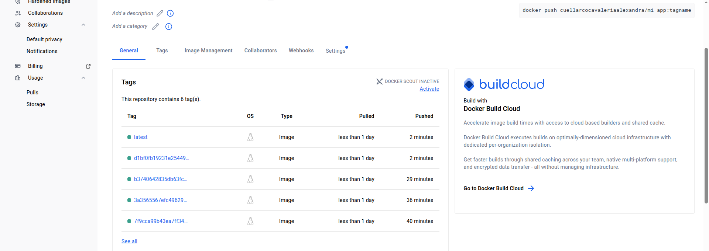

---

## 6. Configuración de GitHub Environments

Se configuraron dos entornos en GitHub con secretos independientes, cada uno apuntando a una instancia EC2 diferente:

| Environment | Secretos configurados | Propósito |
|---|---|---|
| `staging` | `SSH_HOST`, `SSH_USER`, `SSH_PRIVATE_KEY`, `DOCKER_USERNAME` | Primer despliegue de validación |
| `production` | `SSH_HOST`, `SSH_USER`, `SSH_PRIVATE_KEY`, `DOCKER_USERNAME` | Despliegue final a producción |

El flujo del pipeline es secuencial: **staging se despliega primero**, y **solo si staging es exitoso**, se procede con production. Esto garantiza que cualquier error se detecte antes de afectar el entorno de producción.

```yaml
deploy-staging:
  needs: build-and-push
  environment: staging
  # ...

deploy-production:
  needs: deploy-staging
  environment: production
  # ...
```

> **(CAPTURA — Settings > Environments):** Capturar la sección Environments mostrando los entornos `staging` y `production` creados con sus secretos.

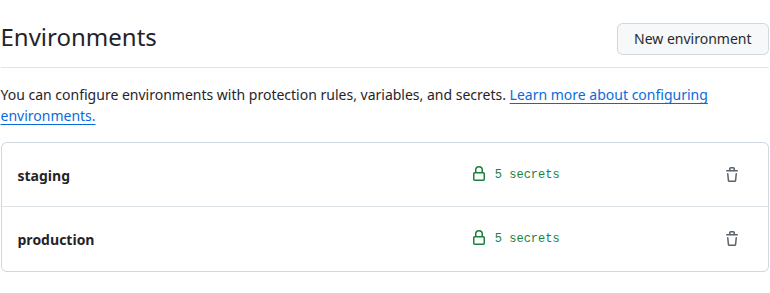


---

## 7. Reflexión: Ventajas de Contenedores y Despliegue Continuo

### 7.1 Ventajas de Docker en el flujo de desarrollo

| Ventaja | Descripción |
|---|---|
| **Consistencia de entornos** | Docker garantiza que la aplicación corre exactamente igual en desarrollo, staging y producción. Se elimina el clásico problema "funciona en mi máquina". |
| **Aislamiento** | Cada contenedor es independiente: tiene sus propias dependencias, variables de entorno y sistema de archivos. Un error en un contenedor no afecta a otros servicios. |
| **Portabilidad** | La imagen Docker puede ejecutarse en cualquier servidor con Docker instalado, independientemente del sistema operativo subyacente (Ubuntu, Amazon Linux, etc.). |
| **Escalabilidad** | Es trivial levantar múltiples instancias del mismo contenedor detrás de un balanceador de carga. Herramientas como Docker Swarm o Kubernetes facilitan la orquestación a gran escala. |
| **Versionamiento inmutable** | Cada imagen es una instantánea inmutable de la aplicación. Esto permite rollbacks instantáneos y auditoría completa del historial de despliegues. |

### 7.2 Ventajas del Despliegue Continuo (CD)

| Ventaja | Descripción |
|---|---|
| **Automatización completa** | Desde el commit hasta producción, no se requiere intervención manual. Esto reduce errores humanos y acelera el ciclo de entrega. |
| **Feedback rápido** | Si un despliegue falla (por ejemplo, el health check no pasa), el equipo recibe notificación inmediata a través de GitHub Actions. |
| **Entregas frecuentes** | Al automatizar el despliegue, el equipo puede liberar cambios pequeños y frecuentes en lugar de grandes releases arriesgados. |
| **Seguridad integrada** | El escaneo de vulnerabilidades (Trivy) se ejecuta automáticamente en cada push, detectando problemas de seguridad antes de que lleguen a producción. |
| **Trazabilidad** | Cada despliegue está vinculado a un commit específico (tag SHA), facilitando la identificación de qué cambio introdujo un problema. |

### 7.3 Aplicación en proyectos reales

En un proyecto real de producción, este pipeline se extendería con:

- **Tests automatizados** antes del build (unit tests, integration tests) para garantizar la calidad del código.
- **Aprobaciones manuales** entre entornos para dar control adicional antes de desplegar a producción.
- **Monitoreo y alertas** post-despliegue con herramientas como Prometheus, Grafana o AWS CloudWatch.
- **Orquestación con Kubernetes** para manejar múltiples servicios, auto-scaling y self-healing.
- **Canary deployments** más sofisticados para exponer gradualmente la nueva versión a un porcentaje del tráfico antes de hacer el swap completo.

La combinación de contenedores Docker + despliegue continuo con múltiples entornos representa el estándar de la industria para equipos de desarrollo modernos, permitiendo entregar valor al usuario final de forma rápida, segura y confiable.

